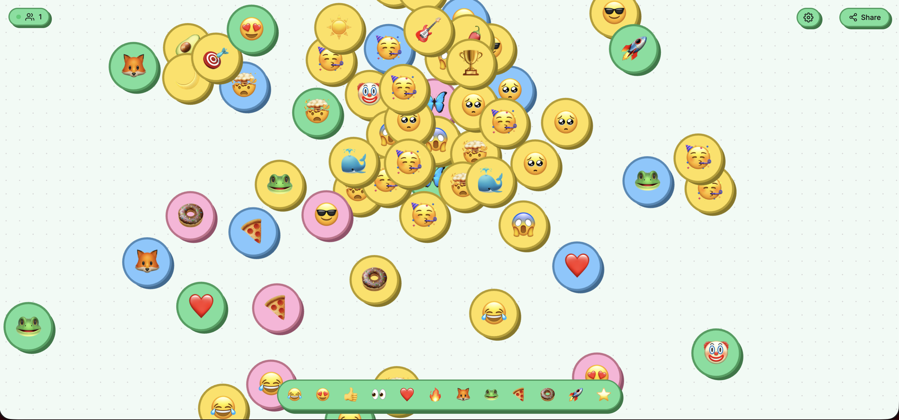
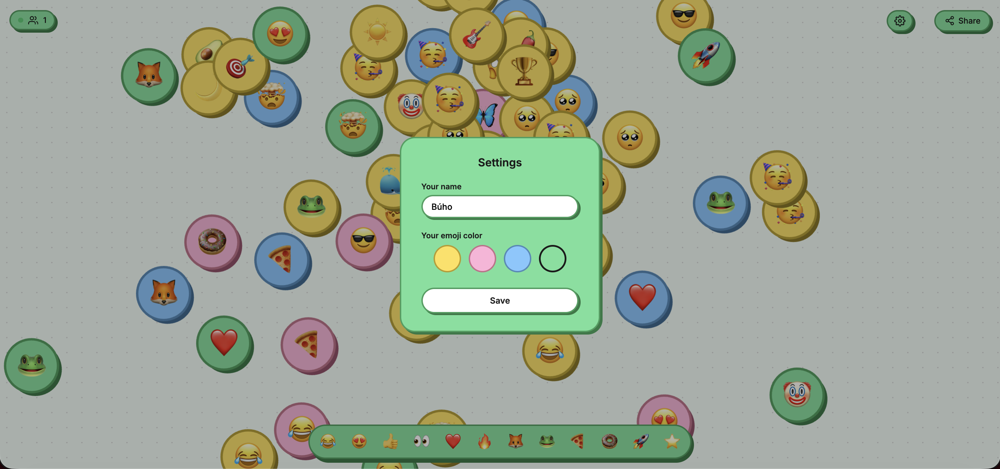

# 🎨 Livemoji Canvas

A real-time collaborative canvas where users place emojis on a shared board. Everyone picks a name and color, and all emojis and cursors are synced instantly across all connected clients.

<!-- Screenshot: general canvas view with several placed emojis and other users' cursors visible -->


## Features

- **Real-time emojis** — Place emojis on the canvas and all connected users see them instantly
- **Live cursors** — Every user sees the other participants' cursors with their names
- **Personalization** — Choose your name and color (yellow, pink, blue, green). The entire UI adapts to your selection
- **Zoom & pan** — Mouse wheel or pinch-to-zoom on mobile
- **Drag & delete** — Move your emojis by dragging them; long-press to delete
- **Auto-cleanup** — Emojis older than 1 week are removed automatically
- **Share** — One-click button to copy the link and invite others

<!-- Screenshot: welcome popup showing the name input, color selector, and instructions -->


## How to use

1. On first visit, a popup appears where you choose your name and color
2. Select an emoji from the bottom bar
3. Tap or click anywhere on the canvas to place it
4. Drag your emojis to reposition them
5. Long-press (or right-click) one of your emojis to delete it
6. Use the mouse wheel or pinch gesture to zoom
7. Click the share button to copy the link

<!-- Screenshot: emoji picker bar with one emoji selected and the "Tap the canvas to place" tooltip visible -->


## Tech stack

| Technology | Purpose |
|---|---|
| [React 19](https://react.dev) | UI and components |
| [TypeScript](https://www.typescriptlang.org) | Static typing |
| [Vite](https://vite.dev) | Bundler and dev server |
| [react-konva](https://konvajs.org/docs/react/) | 2D canvas (Stage, Layer, Rect, Text) |
| [Liveblocks](https://liveblocks.io) | Real-time sync (storage + presence) |
| [nanoid](https://github.com/ai/nanoid) | ID generation |
| [Vercel](https://vercel.com) | Deployment |

## Local development

```bash
# Install dependencies
npm install

# Create .env.local with your Liveblocks public key
echo "VITE_LIVEBLOCKS_PUBLIC_KEY=pk_dev_your_key" > .env.local

# Start the development server
npm run dev
```

## Project structure

```
src/
├── components/
│   ├── EmojiCanvas.tsx      # Main canvas with Konva Stage
│   ├── EmojiNode.tsx        # Individual emoji on the canvas (drag, delete)
│   ├── EmojiPicker.tsx      # Emoji selection bar
│   ├── Cursors.tsx          # Real-time cursors for other users
│   ├── SettingsPopup.tsx    # Name and color settings modal
│   ├── SettingsButton.tsx   # Gear icon button
│   ├── ShareButton.tsx      # Link sharing button
│   └── ConnectionStatus.tsx # Connection indicator and online user count
├── data/
│   ├── emojis.ts            # Available emoji list
│   ├── themes.ts            # Color themes (fill, border, shadow)
│   └── i18n.ts              # Translations (ES / EN)
├── hooks/
│   └── useUserId.ts         # User hook (id, name, color, setup state)
├── types/
│   └── index.ts             # Types (EmojiItem, Presence, Storage)
├── liveblocks.config.ts     # Liveblocks client configuration
├── App.tsx                  # Root component with global RoomProvider
└── index.css                # Base styles and dot grid background
```